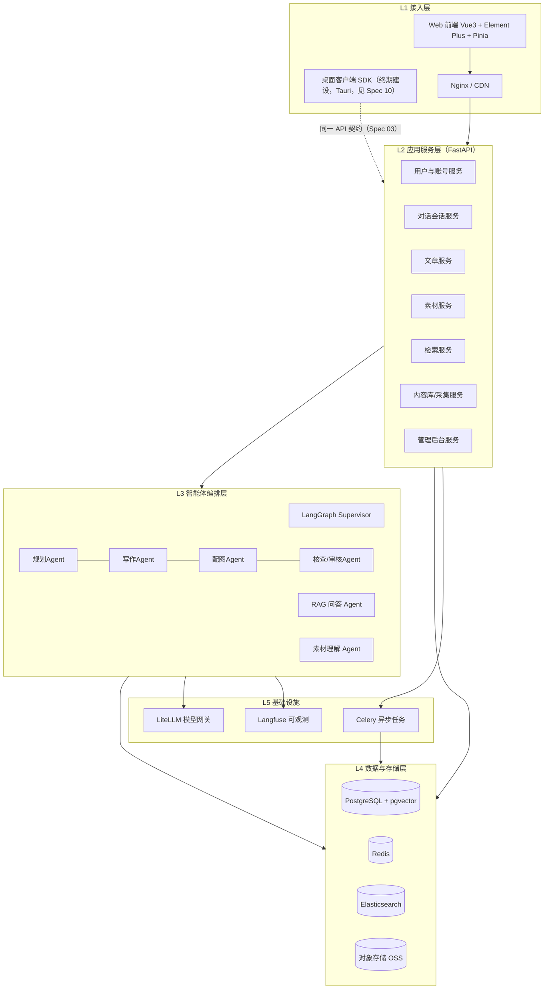
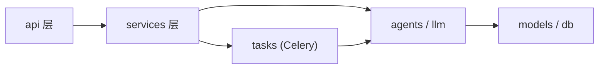

# 01 - EduMeet 系统架构与模块划分

> 版本：v1.0 ｜ 状态：待评审 ｜ 上游文档：00-总览与开发约定

---

## 1. 总体架构



## 2. 模块划分与职责边界

### 2.1 应用服务模块（L2）

| 模块 | 职责 | 对外主要能力 | 关联 Spec |
|---|---|---|---|
| 用户与账号服务 | 注册登录（JWT）、角色（家长/学生/教师/管理员）、个人设置、用户自定义模型 Key 管理 | auth / profile / model-keys | 02/03/07 |
| 对话会话服务 | 会话 CRUD、消息存储、SSE 流式响应、RAG 问答编排入口 | chat | 03/04 |
| 文章服务 | 生成任务管理、草稿/发布生命周期、账号自动绑定、块级文档读写 | articles | 04/08 |
| 素材服务 | 素材上传（预签名直传）、解析、打标、素材库管理 | materials | 05 |
| 检索服务 | 混合检索（ES + 向量 RRF 融合）、权限过滤、筛选聚合 | search | 06 |
| 内容库/采集服务 | 开源内容源抓取、正文抽取、去重、政策结构化、审核入库 | content-library | 06 |
| 管理后台服务 | 审核工作台、举报、内容源配置、模型配置、看板 | admin | 09 |

### 2.2 智能体编排层（L3）

| Agent | 职责 | 输入 → 输出 |
|---|---|---|
| Supervisor | 任务分发与状态机推进 | 生成任务 → 各阶段调度 |
| 规划 Agent | 主题理解、大纲生成、检索参考资料 | 主题+素材 → 大纲 JSON |
| 写作 Agent | 分节生成正文，产出配图指令 | 大纲 → 块级正文 |
| 配图 Agent | 素材库选图优先 / 文生图兜底 | 配图指令 → 图片资源 |
| 核查 Agent | 政策事实核验、时效标注 | 正文 → 核验报告 |
| 审核 Agent | 内容安全审查（未成年人保护/合规） | 正文 → 通过/拦截 |
| RAG 问答 Agent | 对话式检索问答，引用来源 | 用户问题 → 回答+引用 |
| 素材理解 Agent | 文档抽取、图片/视频打标 | 素材文件 → 标签+摘要 |

### 2.3 模块依赖规则



- 依赖单向向下，禁止反向引用；跨模块调用一律经 service 层，禁止 api → api。
- agents 层不直接操作 HTTP 请求对象；LLM 调用必须经 `llm` 封装（LiteLLM），便于路由与追踪。

## 3. 关键技术流程

### 3.1 文章生成（异步）

```
用户提交 → POST /articles/generate（创建任务，绑定 author_id）
        → Celery 任务启动 LangGraph 流水线
        → SSE 推送阶段进度（planning→writing→illustrating→reviewing）
        → 完成：生成草稿 Article（author_id=当前账号）→ 用户编辑 → 发布（机审）
```

### 3.2 对话问答（流式）

```
用户消息 → 会话服务 → RAG Agent（检索公共库+私有授权内容）→ LiteLLM 流式生成
        → SSE message_delta 前端逐字渲染 → 消息落库（含引用列表）
```

### 3.3 检索

```
查询 → 查询改写 → ES(BM25) + pgvector(语义) 并行检索 → RRF 融合 → 权限过滤
    → 结果卡片（标题/摘要/封面/来源标签）
```

## 4. 服务拆分策略

- **一期**：单体 FastAPI 应用内按模块分包（上述 7 个服务为 module），Celery 独立进程，降低运维成本。
- **拆分触发条件**：检索服务或 AI 编排层 QPS/资源独立增长时，优先拆出 `search-service` 与 `agent-service`，接口契约不变。
- 所有服务无状态，会话状态存 Redis，支持水平扩展。
- **桌面端预留**：L1 接入层预留桌面客户端 SDK 位置（终期建设，Spec 10），桌面端复用同一 API 契约（Spec 03）与 Vue3 前端代码库，不新增后端服务；鉴权需在 M3 前预留 OAuth Device Flow / PKCE 扩展点。

## 5. 部署拓扑（一期 Docker Compose）

| 容器 | 说明 |
|---|---|
| frontend | Nginx 托管前端静态资源 + 反代 API |
| backend | FastAPI（uvicorn worker ×2） |
| worker | Celery worker（队列：generate / ingest / media） |
| beat | Celery Beat 定时采集 |
| postgres | 业务库 + pgvector |
| redis | 缓存/Broker |
| elasticsearch | 全文检索（单节点起步） |
| litellm-proxy | LiteLLM 网关容器 |
| minio | S3 兼容对象存储（开发环境；生产替换云 OSS） |

## 6. 验收标准

- [ ] 各模块依赖关系符合 2.3 单向规则（用 import-linter 校验）
- [ ] docker-compose up 一键拉起全部依赖并可完成：注册→对话→生成文章→发布→检索 全链路
- [ ] LLM 调用 100% 经 LiteLLM 网关并上报 Langfuse trace
- [ ] 生成/发布内容 100% 含 author_id（数据库层 NOT NULL 约束）
