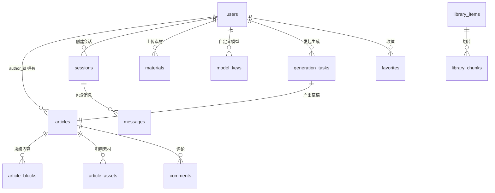

# 02 - EduMeet 数据模型设计

> 版本：v1.0 ｜ 状态：待评审 ｜ 数据库：PostgreSQL 16（+ pgvector 扩展）
> 所有表含公共字段：`id (bigserial PK)`, `created_at`, `updated_at`，下表不再重复。

## 1. ER 总览



## 2. 表结构定义

### 2.1 用户与账号

#### users — 用户表
| 字段 | 类型 | 约束 | 说明 |
|---|---|---|---|
| username | varchar(64) | unique not null | 用户名 |
| email | varchar(128) | unique | 邮箱 |
| password_hash | varchar(128) | not null | bcrypt |
| nickname | varchar(64) | not null | 昵称 |
| role | varchar(16) | not null, default 'parent' | parent/student/teacher/admin |
| avatar_url | varchar(512) | | 头像 |
| region | varchar(64) | | 所在省市（用于政策推荐） |
| status | smallint | default 1 | 1正常 0禁用 |

#### model_keys — 用户自定义模型配置
| 字段 | 类型 | 说明 |
|---|---|---|
| user_id | bigint FK→users | 归属账号 |
| name | varchar(64) | 显示名 |
| provider | varchar(32) | openai_compatible / 官方预置标识 |
| base_url | varchar(512) | OpenAI 兼容地址（预置模型为空） |
| api_key_enc | varchar(1024) | AES-GCM 加密后的 Key |
| model_name | varchar(64) | 模型标识 |
| is_default | boolean | 是否默认模型 |

#### favorites — 收藏
| 字段 | 类型 | 说明 |
|---|---|---|
| user_id | bigint FK→users | |
| target_type | varchar(16) | article / library_item / message |
| target_id | bigint | |

### 2.2 会话与消息

#### sessions — 对话会话
| 字段 | 类型 | 说明 |
|---|---|---|
| user_id | bigint FK→users not null | 归属账号 |
| title | varchar(128) | 会话标题（首条消息自动生成） |
| model_ref | varchar(128) | 本会话使用模型标识 |
| status | smallint | 1活跃 0归档 |

#### messages — 消息
| 字段 | 类型 | 说明 |
|---|---|---|
| session_id | bigint FK→sessions not null | |
| role | varchar(16) | user / assistant |
| content | text not null | 消息正文（Markdown） |
| citations | jsonb | 引用来源列表 `[{type, title, url, snippet}]` |
| model_ref | varchar(128) | 生成所用模型 |
| token_usage | jsonb | `{prompt_tokens, completion_tokens}` |

### 2.3 素材中心

#### materials — 素材
| 字段 | 类型 | 说明 |
|---|---|---|
| user_id | bigint FK→users not null | 归属账号 |
| title | varchar(256) | 素材标题 |
| mtype | varchar(16) not null | image / video / doc / url |
| file_key | varchar(512) | OSS 对象 Key |
| file_size | bigint | 字节 |
| mime_type | varchar(128) | |
| source_url | varchar(1024) | URL 型素材来源 |
| extracted_text | text | 文档抽取正文（doc 类型） |
| cover_key | varchar(512) | 封面图 Key（视频/文档） |
| duration_sec | int | 视频时长 |
| tags | jsonb | AI 自动打标 `[{theme, grade, summary}]` |
| status | smallint | 0处理中 1就绪 2失败 |

### 2.4 文章体系（核心）

#### articles — 文章
| 字段 | 类型 | 约束 | 说明 |
|---|---|---|---|
| author_id | bigint FK→users | **not null** | **账号自动绑定，全生命周期归属** |
| title | varchar(256) not null | | 标题 |
| summary | varchar(512) | | AI 生成摘要 |
| cover_key | varchar(512) | | 封面图 |
| doc | jsonb not null | | **块级文档模型**（见 2.5） |
| content_text | text | | 纯文本冗余（供 ES/向量索引） |
| origin | varchar(16) not null | default 'ai' | ai生成 / user创作 / imported导入 |
| visibility | varchar(16) | default 'private' | private / shared / public |
| status | smallint | | 0草稿 1审核中 2已发布 3驳回 4下架 |
| source_note | varchar(1024) | | 来源/版权声明（imported 必填） |
| grade_level | varchar(16) | | 学段标签（primary/junior/senior） |
| region | varchar(64) | | 地域标签 |
| topic_tags | jsonb | | 主题标签数组 |
| gen_task_id | bigint FK→generation_tasks | | 来源生成任务 |
| stats | jsonb | | `{views, likes, collects}` |

#### article_blocks — 块表（doc 冗余展开，供块级检索与素材关联）
| 字段 | 类型 | 说明 |
|---|---|---|
| article_id | bigint FK→articles not null | |
| block_order | int not null | 顺序 |
| block_type | varchar(16) | heading/paragraph/image/video/quote/list/callout |
| content | jsonb not null | 块内容 |
| material_id | bigint FK→materials | 图片/视频关联素材 |

#### article_assets — 文章-素材关联
| 字段 | 类型 | 说明 |
|---|---|---|
| article_id | bigint FK | |
| material_id | bigint FK | |
| usage | varchar(16) | embedded(内嵌) / referenced(引用) / context(生成上下文) |

#### generation_tasks — 生成任务
| 字段 | 类型 | 说明 |
|---|---|---|
| user_id | bigint FK→users not null | 发起账号（即未来作者） |
| topic | text not null | 主题/指令 |
| outline | jsonb | 规划 Agent 产出大纲 |
| material_ids | jsonb | 勾选的素材 id 数组 |
| model_ref | varchar(128) | 所选模型 |
| stage | varchar(16) | queued/planning/writing/illustrating/reviewing/done/failed/cancelled |
| progress | jsonb | 各阶段详情 |
| result_article_id | bigint FK→articles | 产出草稿 |
| error | text | 失败原因 |

#### comments — 评论（三期）
| 字段 | 类型 | 说明 |
|---|---|---|
| article_id | bigint FK→articles | |
| user_id | bigint FK→users | |
| content | varchar(1024) | 评论内容（发布前机审） |
| parent_id | bigint | 楼中楼 |

### 2.5 块级文档模型（articles.doc JSON Schema）

```json
{
  "version": 1,
  "blocks": [
    {"type": "heading", "level": 2, "text": "一、报名条件"},
    {"type": "paragraph", "text": "……"},
    {"type": "image", "materialId": 123, "url": "https://oss/…", "caption": "入学流程图", "origin": "material|generated"},
    {"type": "video", "materialId": 456, "url": "…", "coverUrl": "…"},
    {"type": "callout", "style": "warning", "text": "以官方最新发布为准"},
    {"type": "citation", "refIndex": 0, "text": "海淀区教委 2025 文件"}
  ],
  "citations": [{"title": "…", "url": "…", "type": "official|community"}]
}
```

### 2.6 公共内容库

#### library_items — 内容条目
| 字段 | 类型 | 说明 |
|---|---|---|
| source_url | varchar(1024) not null | 来源 URL（去重键） |
| source_site | varchar(128) | 来源站点 |
| license | varchar(64) | 许可协议 |
| title | varchar(256) | 标题 |
| content_text | text | 正文纯文本 |
| content_type | varchar(16) | policy(政策) / material(学习资料) / experience(经验) / news |
| region | varchar(64) | 省市 |
| grade_level | varchar(16) | 学段 |
| pub_year | int | 政策年份 |
| version_tag | varchar(32) | 政策版本（如 2025-北京） |
| is_current | boolean | 是否现行有效（历史版本 false 降权） |
| status | smallint | 0待审 1已收录 2下架 |

#### library_chunks — 检索切片
| 字段 | 类型 | 说明 |
|---|---|---|
| item_id | bigint FK→library_items | |
| chunk_text | text | 切片文本 |
| chunk_index | int | 顺序 |
| embedding | vector(1024) | pgvector 向量 |
| tsv | tsvector | 全文向量（GIN 索引） |

> 说明：私有文章的向量检索复用 library_chunks 结构，通过 `owner_type/owner_id` 区分（迁移时增加列：`owner_type` = 'library' / 'article'）。

### 2.7 审核与治理（三期，一期建表不建功能）

#### audit_records — 审核记录
| 字段 | 类型 | 说明 |
|---|---|---|
| target_type | varchar(16) | article / comment / message |
| target_id | bigint | |
| audit_type | varchar(16) | machine(机审) / human(人审) |
| result | varchar(16) | pass / reject / manual |
| reason | text | 拦截原因 |
| auditor_id | bigint | 人审操作员 |

#### reports — 举报
| 字段 | 类型 | 说明 |
|---|---|---|
| reporter_id | bigint FK→users | |
| target_type / target_id | | 被举报对象 |
| reason | varchar(256) | |
| status | smallint | 待处理/已处理 |

### 2.8 会员与积分计费表

计费体系的 6 张表（memberships / credit_accounts / credit_ledger / model_pricing / recharge_orders / free_quota_usage）完整定义见 **Spec 11 §7**，本文档不重复；ER 关系：users 1—1 memberships / credit_accounts，users 1—N credit_ledger / recharge_orders，model_pricing 与 07 的模型目录同源维护。

> 双余额 FIFO：credit_accounts 分 balance_paid（充值，永久）与 balance_gift（赠送，按月过期）；所有扣减必须同事务写 credit_ledger（幂等键 ref_type+ref_id）。

## 3. 索引设计（关键）

| 表 | 索引 | 用途 |
|---|---|---|
| articles | (author_id, status), (visibility, status) | 个人文章列表 / 公开流 |
| articles | GIN(topic_tags), btree(grade_level, region) | 筛选 |
| library_items | unique(source_url) | 采集去重 |
| library_chunks | GIN(tsv), ivfflat(embedding vector_cosine_ops) | 混合检索 |
| materials | (user_id, mtype, status) | 素材库列表 |
| sessions | (user_id, status, updated_at desc) | 左栏会话列表 |
| generation_tasks | (user_id, stage) | 任务列表 |
| model_keys | unique(user_id, name) | |

## 4. 验收标准

- [ ] Alembic 迁移可从空库一键构建全部表
- [ ] `articles.author_id` 为 NOT NULL，插入无主内容直接报错
- [ ] 块级文档 doc 通过 Pydantic 模型校验（version/blocks/citations）
- [ ] library_chunks 的 tsvector 与 vector 列可分别命中，RRF 检索 SQL 有单测
- [ ] 所有加密字段（api_key_enc）在接口响应中永不明文返回
