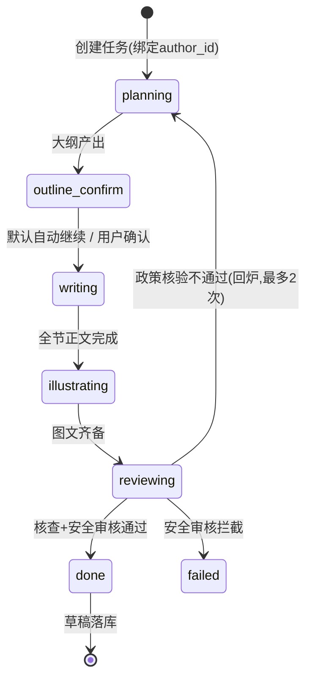

# 04 - EduMeet 文章自动生成与智能体编排

> 版本：v1.0 ｜ 状态：待评审 ｜ 技术：LangGraph（Supervisor）+ Celery + LiteLLM

---

## 1. 目标与范围

实现「主题 → 图文文章草稿」的多智能体自动生成流水线：规划、写作、配图、核查、安全审核五阶段；生成结果**自动绑定当前账号**为草稿，用户可编辑后发布。覆盖对话中触发的轻量生成与编辑器中的完整生成两种入口。

## 2. LangGraph 状态机设计



### 2.1 共享 State（TypedDict）

```python
class GenState(TypedDict):
    task_id: int
    user_id: int              # 作者账号，落库唯一来源
    topic: str
    region: str | None
    grade_level: str | None
    material_contexts: list   # 勾选素材的解析内容/元信息
    outline: dict | None      # {sections: [{title, points, image_hint}]}
    sections: list[dict]      # 写作产出块
    citations: list[dict]     # 检索到的引用来源
    verify_report: dict | None
    revision: int             # 回炉次数
```

### 2.2 各 Agent 节点规格

| 节点 | 模型建议 | 输入 | 输出 | Prompt 要点 |
|---|---|---|---|---|
| planner | 强推理模型 | topic + region/学段 + 素材上下文 | outline JSON | 大纲 3~7 节；先调用检索工具取政策/经验参考；输出 `{sections, citations}` |
| writer | 长文模型 | outline + citations + 素材 | 块级正文（Markdown→blocks） | 按节生成；引用标注 `[ref:n]`；不得编造政策数字；素材内容自然融入对应节 |
| illustrator | 文生图/多模态 | 各节 image_hint + 素材库候选 | image blocks | 优先从用户素材/公共图库按语义选图；无合适图时文生图（教育插画风格，禁人物特写） |
| verifier | 强推理模型 | 正文 + citations | verify_report | 核对政策数字/时间与来源一致性；缺失时效标注则补充 callout |
| safety | 内容安全模型/接口 | 全文 | pass/reject | 未成年人保护、教育合规词表、伪科学建议拦截 |

### 2.3 工具（Tool）注册

- `search_library(query, filters)`：检索公共内容库与授权私有文章（复用 06 检索服务）
- `list_user_materials(user_id, mtype)`：用户素材候选
- `fetch_material(material_id)`：读取素材解析文本/元信息
- `save_draft(article_payload)`：唯一落库出口，强制 `author_id=state.user_id`

## 3. 异步执行与进度

1. `POST /generation-tasks` → 写 `generation_tasks`（stage=queued, user_id=当前账号）→ 投递 Celery 队列 `generate`。
2. worker 拉起 LangGraph 编译图，逐节点执行；每节点开始/结束更新 DB `stage/progress` 并发 Redis pub/sub → SSE 通道（03 文档 5.1）。
3. 失败处理：节点级重试 2 次 → 整体 failed 并保留中间产物（outline/sections 可恢复）→ 支持从失败阶段续跑。
4. 超时：单任务上限 10 分钟；取消消息经 Redis 下发中断。

## 4. 账号自动绑定机制（核心需求②）

- 绑定时点：任务创建即确定作者（`generation_tasks.user_id`），**早于任何内容产生**。
- 唯一落库出口 `save_draft` 从 State 读取 `user_id` 写入 `articles.author_id`（NOT NULL 数据库约束兜底）。
- 任务与文章全链路校验：`articles.gen_task_id → generation_tasks.user_id` 必须与 `articles.author_id` 一致（数据校验脚本 + 单测）。
- 后续编辑/发布/删除接口同样以 JWT 账号校验所有权，不出现无主或转属内容。

## 5. 图文模式

- 写作输出统一为块级文档（02 文档 2.5 Schema），图片块携带 `origin: material|generated` 与版权信息。
- 配图选源优先级：用户勾选素材 > 用户素材库语义匹配 > 公共可商用图库 > 文生图生成。
- 一期简化：正文以 Markdown 存 `content_text`，图片块内联 ``；二期切换块级 doc JSON（前端编辑器同步演进，见 08 文档）。

## 6. Prompt 管理

- 目录 `backend/app/agents/prompts/{planner,writer,illustrator,verifier,safety}.md`，Jinja2 模板 + 版本号注释。
- Prompt 变更需附评测用例（10 条固定主题冒烟集）跑通后合入；Langfuse 记录每次调用的 prompt 版本。

## 7. 验收标准

- [ ] 给定「幼升小政策解读」「初中数学学习方法」等 10 条冒烟主题，流水线端到端产出图文草稿，成功率 ≥ 90%
- [ ] 生成草稿 100% 含正确 author_id（随机账号并发 50 任务无串号）
- [ ] SSE 进度事件在每阶段切换时推送，前端可渲染进度条（03 文档契约）
- [ ] 安全拦截样例集（含未成年隐私/违规内容 10 条）100% 拦截并标记 failed
- [ ] 政策类文章 100% 携带 citations 与时效 callout
- [ ] 单元测试覆盖每个 Agent 节点的输入输出契约；断点续跑用例通过
