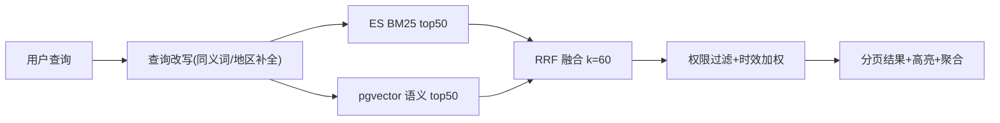

# 06 - EduMeet 检索与图文展示

> 版本：v1.0 ｜ 状态：待评审 ｜ 技术：Elasticsearch 8（IK 分词）+ pgvector 混合检索

---

## 1. 目标与范围

实现「全文 + 语义」混合检索，覆盖公共内容库（开源文章）与平台公开私有文章；检索结果与图文阅读器界面化展示，支持目录导航、图片灯箱、视频播放、来源引用。同时为 RAG 问答与文章生成提供检索工具底座。

## 2. 索引设计

### 2.1 索引范围

| 对象 | 入索引条件 | 权重 |
|---|---|---|
| library_items | status=1 已收录 | 政策现行版 > 历史版（is_current） |
| articles（私有） | visibility=public 且 status=2 已发布 | 完整性/互动加权 |

### 2.2 ES Mapping（要点）

```json
{
  "title":       {"type": "text", "analyzer": "ik_max_word", "search_analyzer": "ik_smart"},
  "content":     {"type": "text", "analyzer": "ik_max_word"},
  "summary":     {"type": "text"},
  "obj_type":    {"type": "keyword"},          // library_item | article
  "obj_id":      {"type": "long"},
  "content_type":{"type": "keyword"},          // policy/material/experience
  "region":      {"type": "keyword"},
  "grade_level": {"type": "keyword"},
  "pub_year":    {"type": "integer"},
  "is_current":  {"type": "boolean"},
  "source_label":{"type": "keyword"},          // official/community/private
  "cover_url":   {"type": "keyword", "index": false},
  "updated_at":  {"type": "date"}
}
```

### 2.3 向量索引

- 切片入库 `library_chunks`（含 article 与 library 两类 owner），embedding 1024 维（bge-m3 或平台选定模型）。
- 私有文章发布时异步切片 + 向量化；内容库条目收录时同步处理。

## 3. 混合检索流程



- 查询改写：轻量规则 + 可选 LLM 改写开关（「海淀幼升小」→ 地区=北京/海淀区、content_type=policy 提示）。
- 融合公式：RRF `score = Σ 1/(60+rank)`；时效加权：现行政策 ×1.2，近一年 ×1.1。
- 权限过滤在 DB 层二次校验 obj_id 是否仍 public/收录，防止越权泄漏。

## 4. 检索 API 行为（配合 03 文档第 8 节）

- `scope=all` 默认；筛选：region / grade_level / content_type / source_label。
- 返回 facets 聚合计数供前端筛选面板；关键词高亮 `<em>`。
- suggest：基于 completion suggester，前缀联想历史热门查询。

## 5. 图文阅读器（核心需求③）

### 5.1 展示规格

| 能力 | 规格 |
|---|---|
| 块级渲染 | 按 doc.blocks 顺序渲染：标题(h2~h4)/段落/图片/视频/引用/callout |
| 目录导航 | 右侧悬浮目录，滚动高亮当前节；移动端折叠 |
| 图片 | 懒加载 + 点击灯箱（缩放/左右切换/看图计数） |
| 视频 | 内嵌播放器（HLS/MP4），封面帧海报，播放计数 |
| 引用 | 引用角标悬浮显示来源摘要，点击跳转来源（外部 URL 新窗打开） |
| 来源标签 | 文章头部展示：来源类型（官方政策/社区经验/私有分享）、地区、学段、更新时间 |
| AI 摘要 | 「AI 摘要」折叠卡片（生成时落库 summary） |
| 相关推荐 | 同 region+grade+topic 向量相似 top5 |
| 互动 | 点赞/收藏/（三期：评论） |

### 5.2 检索结果页

- 卡片式列表：封面图 + 标题（高亮）+ 摘要两行 + 标签组（来源/地区/学段/年份）。
- 左侧筛选面板（桌面）/顶部筛选抽屉（移动）；空态引导「让 AI 为你生成/解答」。
- 分页：滚动加载。

## 6. 内容库治理（开源文章来源，需求⑥）

1. **采集**：Celery Beat 按 `admin/sources` 配置定时抓取（白名单站点 + RSS）；限速与 UA 合规。
2. **清洗**：正文抽取 → HTML 净化 → 去重（URL 精确 + 标题 SimHash）。
3. **结构化**：LLM 抽取政策元数据（region/年份/学段/要点），打 content_type。
4. **入库**：library_items（含 license、source_url）→ 审核 → 建索引。
5. **时效**：新版本政策入库时同源旧版 `is_current=false`。

## 7. 验收标准

- [ ] 100 条评测查询（政策 40/资料 30/经验 30）混合检索 NDCG@10 优于纯 ES 基线 ≥ 10%
- [ ] 检索 P95 < 500ms（top20）；facets 与筛选联动正确
- [ ] 权限：私有未公开文章任何路径不可被检索到（渗透用例）
- [ ] 阅读器：三类内容（含图片文章、含视频文章、政策长文）渲染正确，目录高亮准确
- [ ] 采集任务：白名单站点抓取、去重、来源/版权字段完整入库；重复运行无重复数据
