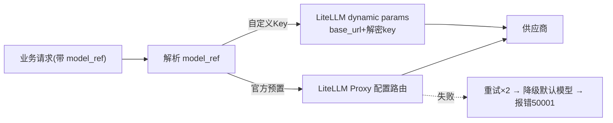

# 07 - EduMeet 大模型接入与路由

> 版本：v1.0 ｜ 状态：待评审 ｜ 技术：LiteLLM Proxy + 自研路由封装

---

## 1. 目标与范围

满足需求⑤「自定义选择大模型」：平台预置多家主流模型供下拉选择；用户可接入 OpenAI 兼容自定义模型（Base URL + API Key）；所有对话与生成请求按「用户所选模型」路由，统一治理超时、重试、降级、用量与配额。

## 2. 模型目录设计

### 2.1 官方预置模型（平台配置，管理员维护）

> 选型原则：图文友好 + 高性价比，不锁定单一厂商，按 P0/P1/P2 分批接入（行情调研 2026-09，价格为公开 API 定价参考，以官网实时价为准）。选型对比详见下方第 6 节。

| 批次 | 模型标识 | 供应商 | 场景 | 默认 |
|---|---|---|---|---|
| P0 | doubao-pro | 字节 · 火山方舟 | 高频对话、文章初稿（价格极低 0.8/2） | ✅ |
| P0 | deepseek-chat | 深度求索 | 正文生成、政策要点抽取（2/8） | |
| P0 | qwen-plus | 阿里云 DashScope | 政策理解、查询改写（2/4） | |
| P0 | qwen-vl-plus | 阿里云 DashScope | 素材识图打标、配图选图 | |
| P1 | glm-4-air / glm-5 | 智谱 AI | Agent 工具调用、1M 长上下文档 | |
| P1 | kimi-k2 | 月之暗面 | 长素材提炼、长文续写 | |
| P0(生图) | wanx2.x | 阿里 · 通义万相 | 文章配图/封面（教育插画） | ✅ |
| P0(生图) | seedream | 字节 · 火山方舟 | 封面/信息图风格配图 | |
| P1(生图) | qwen-image / flux.2 | 阿里 / BFL | 带字信息图 / 开源可私有化 | |
| P2 | gpt-4o-mini、gemini-flash、gpt-image-2 | OpenAI / Google | 高级用户可选、多语料与顶级生图 | |
| — | bge-m3 / text-embedding-3 | — | 向量化（系统内部固定，不暴露选择） | — |

### 2.2 用户自定义模型（model_keys 表）

- 协议：仅 OpenAI Chat Completions 兼容（`/v1/chat/completions`，支持 `stream`）。
- 保存时校验：调用一次 `models` + 短对话连通性测试，失败不予保存。
- 隔离：自定义 Key 仅本人请求生效；服务端解密后注入 LiteLLM `api_base/api_key` 参数，不落日志。

## 3. 请求路由流程



- 封装层 `app/llm/router.py`：`chat(model_ref, messages, stream, **kwargs)`，业务代码只认 model_ref。
- 流式：LiteLLM `stream=True` → FastAPI SSE（03 文档事件契约）。
- 降级链：主模型失败重试 2 次 → 预置默认模型兜底（自定义 Key 不参与兜底）→ 最终 50001。

## 4. 用量、配额与成本

| 机制 | 规格 |
|---|---|
| 用量记录 | 每次调用记录 messages.json 中 token_usage + model_ref + 耗时，上报 Langfuse trace |
| 沙箱控制 | **路由层强制**：免费用户仅可用 Free 档模型（名单硬编码兑底）+ 每日免费额度；付费会员按等级开放模型范围；触达越级模型自动降级/拦截（40302），完整规则见 Spec 11 §5 |
| 积分扣费 | 调用前余额预检（不足 40303 不产生厂商成本）；完成后按实际 usage × 积分单价结算（单价 = 混合价×10×1.05，含 5% 利润）；流水幂等，失败全额退还；见 Spec 11 §6 |
| 配额 | 用户级：并发生成任务按会员等级 1~3；免费日额度按场景计数；超限 42900 / 40304 |
| 成本 | LiteLLM 按 token 计价统计；预置模型成本计入平台并由积分收入覆盖（5% 利润空间），自定义 Key 成本归属用户 |
| 敏感控制 | 自定义 Key 加密存储（AES-GCM，密钥走环境变量 KMS）；日志脱敏 |

## 5. 管理能力

- 管理员可增删预置模型、调整默认模型、设置全局并发与配额（/admin 接口，三期完善 UI）。
- 模型健康检查：定时探活（每小时），异常模型前端列表标灰「暂不可用」。

## 6. 模型选型推荐（图文友好 · 高性价比，分批接入）

平台对模型不做单一绑定，按「能力 × 价格 × 国内可用性」选型，分 P0/P1/P2 三批接入：

### 6.1 文本对话 / 文章生成

| 批次 | 模型 | 优势 | 不足 | 建议用途 |
|---|---|---|---|---|
| P0 | 豆包 Pro（Seed 系，火山方舟） | 价格极低（约 0.8/2 元每百万 token）、中文语义第一梯队、响应快、免费额度大、国内直连 | 幻觉率偏高（须配合核查 Agent）、深度推理弱于旗舰 | 高频对话、文章初稿 |
| P0 | DeepSeek V3.x | 地板价（约 2/8）、综合性价比最高、工具调用稳定、开源可私有化 | 原生多模态偏弱、高峰期限流 | 正文生成、政策要点结构化 |
| P0 | 通义千问 Qwen3-Plus | 中文/政策语料适配好、DashScope OpenAI 兼容、开源全尺寸 | 旗舰 Max 档价格偏高 | 政策理解、查询改写 |
| P1 | 智谱 GLM-4.x / GLM-5 | Agent 工具调用稳定、Plus 档 1M 上下文、价格友好 | 生态与社区规模稍小 | 多智能体工具调用节点 |
| P1 | Kimi K2（Moonshot） | 长上下文强，适合长文档总结与长文写作 | 幻觉控制一般、价格高于豆包档 | 长素材提炼、长文续写 |
| P2 | GPT-4o-mini / Gemini Flash | 多模态与多语言强、生态成熟 | 海外网络与合规评估、美元计价 | 高级用户可选模型 |

### 6.2 图像理解（素材识图打标 / 配图选图）

| 批次 | 模型 | 优势 | 不足 |
|---|---|---|---|
| P0 | Qwen-VL-Plus（阿里） | 中文图文理解好、价格低、与 Qwen3 同栈 | 复杂图表推理弱于旗舰 |
| P1 | GLM-4V（智谱） | 识图+文字提取稳定、API 友好 | 极限场景准确率一般 |
| P2 | GPT-4o-mini / Gemini Flash 多模态 | 综合识图能力最强档 | 网络与合规成本 |

### 6.3 文生图（文章配图 / 封面）

| 批次 | 模型 | 优势 | 不足 | 接入方式 |
|---|---|---|---|---|
| P0 | 通义万相 wanx2.x | 中文理解稳、海报/封面/教育插画顺手、价格低、商用条款清晰 | 纯艺术上限略逊海外顶级 | DashScope 异步 API |
| P0 | Seedream（即梦系） | 中文语义强、出图快、封面/信息图风格突出 | 商用授权条款需逐版确认 | 火山方舟 Images API |
| P1 | Qwen-Image | 中文文字渲染强（带字封面不乱码）、开源可自部署 | 复杂构图一般 | DashScope / 开源自部署 |
| P1 | FLUX.2 | 开源可控、细节与人物一致性强、可教育风格微调 | 需自建 GPU 推理或三方托管 | BFL / fal / Replicate |
| P2 | GPT Image 2 / HunyuanImage 3.0 | 质量顶级 / 开放权重 | 成本合规高 / 部署门槛 | 官方 API / 开源权重 |

### 6.4 分批接入节奏

- **P0 首批（一期上线即用）**：豆包 Pro + DeepSeek（文本）、Qwen-VL（识图）、通义万相（生图），覆盖全部核心场景且成本最低。
- **P1 二批（二期）**：GLM、Kimi、Qwen-Image、FLUX，补充长上下文与生图能力。
- **P2 可选（三期+）**：面向高级用户开放海外模型（需合规评审）。
- 所有模型经 LiteLLM 网关接入，新增模型只改配置不改业务代码；模型价格/能力随行情变化，`admin/sources` 同源机制维护模型健康与成本看板，每季度复审一次选型。

## 7. 接入方法 Demo（多厂商）

### 7.1 文本模型：LiteLLM 统一配置（推荐方式）

```yaml
# litellm/config.yaml —— 新增模型只加一段配置，业务代码零改动
model_list:
  - model_name: doubao-pro                # P0：字节火山方舟（OpenAI 兼容）
    litellm_params:
      model: openai/doubao-seed-1.6
      api_base: https://ark.cn-beijing.volces.com/api/v3
      api_key: os.environ/ARK_API_KEY

  - model_name: deepseek-chat             # P0：DeepSeek 官方协议
    litellm_params:
      model: deepseek/deepseek-chat
      api_key: os.environ/DEEPSEEK_API_KEY

  - model_name: qwen-plus                 # P0：通义 DashScope 兼容模式
    litellm_params:
      model: openai/qwen-plus
      api_base: https://dashscope.aliyuncs.com/compatible-mode/v1
      api_key: os.environ/DASHSCOPE_API_KEY

  - model_name: qwen-vl-plus              # P0：图像理解
    litellm_params:
      model: openai/qwen-vl-plus
      api_base: https://dashscope.aliyuncs.com/compatible-mode/v1
      api_key: os.environ/DASHSCOPE_API_KEY

  - model_name: glm-4-air                 # P1：智谱
    litellm_params:
      model: openai/glm-4-air
      api_base: https://open.bigmodel.cn/api/paas/v4
      api_key: os.environ/ZHIPU_API_KEY

  - model_name: kimi-k2                   # P1：月之暗面
    litellm_params:
      model: openai/moonshot-v1-128k
      api_base: https://api.moonshot.cn/v1
      api_key: os.environ/MOONSHOT_API_KEY

litellm_settings:
  num_retries: 2
  request_timeout: 60
  fallbacks:
    - doubao-pro: [deepseek-chat, qwen-plus]   # 降级链
```

### 7.2 业务侧统一调用（llm/router.py）

```python
import litellm

async def chat(model_ref: str, messages: list[dict], stream: bool = False, **kw):
    """业务代码只认 model_ref（如 'doubao-pro'），路由细节由 LiteLLM 承担"""
    if model_ref.startswith("custom:"):            # 用户自定义 Key（07 §2.2）
        key_cfg = await load_user_key(model_ref)   # 解密 api_key_enc
        return await litellm.acompletion(
            model=f"openai/{key_cfg.model_name}",
            api_base=key_cfg.base_url,
            api_key=key_cfg.decrypt(),
            messages=messages, stream=stream, **kw)
    return await litellm.acompletion(
        model=model_ref, messages=messages, stream=stream, **kw)
```

### 7.3 文生图：统一 image-service 封装（异步任务型 API）

```python
# app/services/image_gen.py —— 配图 Agent 调用 generate_image(prompt, style)
import httpx, asyncio

class ImageGenService:
    """通义万相（DashScope 异步任务）Demo；Seedream 同理走火山方舟 images API"""

    async def generate_image(self, prompt: str, style: str = "education") -> str:
        submit = await httpx.AsyncClient().post(
            "https://dashscope.aliyuncs.com/api/v1/services/aigc/text2image/image-synthesis",
            headers={"Authorization": f"Bearer {DASHSCOPE_KEY}"},
            json={"model": "wanx2.1-t2i-turbo",
                  "input": {"prompt": f"{prompt}，{style} 风格，适合教育文章配图"},
                  "parameters": {"size": "1024*576", "n": 1}})
        task_id = submit.json()["output"]["task_id"]
        while (r := await self._poll(task_id))["task_status"] == "RUNNING":
            await asyncio.sleep(2)                     # 异步轮询直至 SUCCEEDED
        return r["results"][0]["url"]                  # 上传 OSS 后写入 image block
```

### 7.4 直连厂商 SDK（LiteLLM 不可用时的备选）

```python
# DeepSeek 官方 SDK 示例（openai 兼容客户端）
from openai import AsyncOpenAI
client = AsyncOpenAI(api_key=DEEPSEEK_KEY, base_url="https://api.deepseek.com")
resp = await client.chat.completions.create(
    model="deepseek-chat", messages=messages, stream=True)

# 智谱官方 SDK
from zhipuai import ZhipuAI
zk = ZhipuAI(api_key=ZHIPU_KEY)
zk.chat.completions.create(model="glm-4-air", messages=messages)

# 火山方舟（豆包/Seedream）官方 SDK
from volcenginesdkarkruntime import Ark
ark = Ark(api_key=ARK_KEY)
ark.chat.completions.create(model="doubao-seed-1.6", messages=messages)
```

> 统一规范：无论直连还是经 LiteLLM，调用都必须经 `app/llm/router.py` 出口，保证 Langfuse trace、用量统计与降级策略生效；各厂商真实模型名/价格接入前以官网最新文档核验。

## 8. 验收标准

- [ ] 同一会话切换模型后消息继续，response 的 model_ref 正确
- [ ] 自定义模型连通性校验、保存、选择、调用全链路通过；DB 中密文、响应/日志无明文 Key
- [ ] 主模型宕机时自动降级默认模型并发出降级标记事件
- [ ] token_usage 与 Langfuse trace 一致；配额超限返回 42900
- [ ] 嵌入模型固定为系统级，不出现在用户可选列表
- [ ] P0 四个模型（豆包/DeepSeek/Qwen3/Qwen-VL）+ 生图（通义万相）接入 Demo 跑通连通性测试
- [ ] 沙箱在路由层强制生效：免费账号任何入口无法调用付费模型；积分单价与 Spec 11 公式一致；账单与 Langfuse usage 可对平
- [ ] 模型选型表中的价格/模型名与官网核验记录归档（模型台账）
