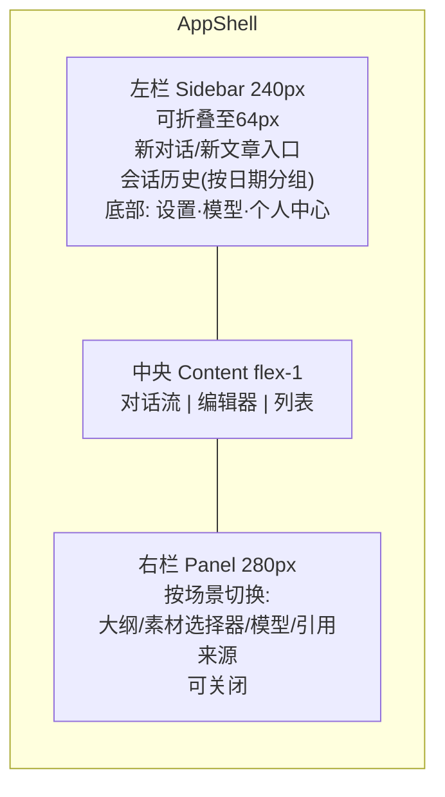

# 08 - EduMeet 前端页面与交互设计

> 版本：v1.0 ｜ 状态：待评审 ｜ 技术：Vue3 + TS + Vite + Element Plus + Pinia + TipTap
> 布局对标 ChatGPT 网页版（需求①）：左侧导航栏 + 中央内容区 + 右侧上下文面板，三栏可折叠。

---

## 1. 路由与页面清单

| 路由 | 页面 | 布局模式 | 期数 |
|---|---|---|---|
| /login, /register | 登录注册 | 独立页 | 一期 |
| /chat/:sessionId? | 对话工作台（默认首页） | 三栏 | 一期 |
| /chat | 新对话 | 三栏 | 一期 |
| /editor/:articleId | 文章编辑器 | 三栏（右侧=大纲+素材面板） | 一期MVP/二期完整 |
| /library | 检索与公开文章流 | 顶部搜索 + 筛选 + 卡片列表 | 二期 |
| /library/:id | 图文阅读器 | 阅读页 + 悬浮目录 | 二期 |
| /materials | 素材中心 | Tab + 网格 | 二期 |
| /profile | 个人中心（我的文章/素材/会话/设置/模型） | 左菜单右内容 | 一期/二期 |
| /admin/* | 管理后台 | 独立后台布局 | 三期 |

## 2. 全局布局规范

- 移动端：左栏转抽屉，右栏转底部抽屉；断点 768px。
- 主题：Element Plus 默认浅色 + 品牌蓝 #2563eb；预留暗色。

## 3. 核心页面规格

### 3.1 对话工作台 /chat（对标 ChatGPT）

- 消息流：用户右气泡（浅蓝）、AI 左全宽卡片（无气泡，参考 chatgpt.com 风格）；Markdown 渲染 + 代码高亮；引用角标悬浮卡片。
- 输入框：圆角输入区，左侧「📎 素材」、右侧「🧩 模型选择（记忆上次选择）」与发送按钮；Enter 发送 / Shift+Enter 换行。
- SSE 渲染：`message_delta` 逐字追加 + 光标动画；`citation` 渲染引用卡片组；`article_suggestion` 渲染草稿卡片（查看/编辑按钮）；中断/重新生成按钮。
- 空态：欢迎语 + 4 个能力入口（政策问答/生成文章/学习资料/经验分享）+ 示例提问 chips。
- 会话管理：左栏历史分组（今天/近7天/更早），重命名/删除/归档。

### 3.2 文章编辑器 /editor

- TipTap 编辑区 + 顶部工具条（标题层级/加粗/引用/图片/视频/撤销）+ 右栏（大纲导航 + 素材面板 + 引用管理）。
- AI 辅助浮动菜单：选中文本 → 续写/改写/扩写/缩写/纠错（调用所选模型流式替换）。
- 素材插入：右栏素材搜索网格 → 点击/拖拽插入对应块（05 文档集成规则）；`@` 唤起选择器。
- 生成进度视图：进入编辑器时若关联任务未完成，展示阶段进度条（planning→writing→illustrating→reviewing）与已完成节预览，可取消。
- 保存：自动保存草稿（防抖 3s）+ 手动保存；发布按钮触发机审（loading → 成功/驳回原因）。
- 一期简化：Markdown 源模式 + 图片插入；二期切块级 doc 结构化编辑。

### 3.3 检索与阅读 /library

- 结果页：顶部大搜索框 + 左侧筛选（来源/地区/学段/类型/年份，facets 计数）+ 卡片列表（滚动分页）；来源标签色系：官方政策蓝 / 社区经验绿 / 私有分享紫。
- 阅读器：按 06 文档 5.1 规格实现（目录、灯箱、视频、引用、AI 摘要、相关推荐）。

### 3.4 素材中心 /materials

- 类型 Tab + 搜索 + 上传区（拖拽/点击/粘贴）；卡片显示封面、标题、标签、状态（处理中 skeleton / 就绪 / 失败重试）。
- 详情抽屉：预览（图片大图/视频播放/文档摘要）、编辑标题标签、删除（冲突提示）。

### 3.5 个人中心 /profile 与设置

- 我的文章（状态 Tab：草稿/审核中/已发布/驳回）；我的素材；会话记录；账号设置（昵称/角色/地区）。
- 模型设置：官方预置列表（默认勾选态）+「添加自定义模型」表单（name/base_url/api_key/model_name）+ 连通性测试按钮 + Key 脱敏展示。

## 4. 状态管理（Pinia Stores）

| Store | 状态 | 关键动作 |
|---|---|---|
| userStore | token、userInfo、role | login/logout/fetchMe |
| sessionStore | sessions、currentSession、messages、streamingState | send.sendMessage(SSE)/stop/rename |
| articleStore | drafts、currentArticle、genTask、taskProgress | createGenTask/subscribeTask(SSE)/save/publish |
| materialStore | materials、uploading[]、filters | presignUpload/fetch/remove |
| modelStore | officialModels、myKeys、currentModelRef | fetchModels/addKey/setCurrent |
| searchStore | query、filters、facets、items | search/loadMore |

## 5. 通用组件与 Composables

| 项 | 说明 |
|---|---|
| useSSE | 封装 EventSource/fetch-stream：自动重连、事件分发、中止控制器 |
| useUpload | 预签名直传 + 进度 + 重试 |
| BlockRenderer | 块级 doc → Vue 组件树（阅读器与预览共用） |
| CitationCard / MaterialPicker / ModelSelector / ProgressTimeline | 复用组件 |
| EmptyState / AuthGuard（路由守卫） | 全局 |

## 6. 验收标准

- [ ] 布局对标验收：三栏折叠、移动端抽屉、对话流式渲染、历史分组与 ChatGPT 交互习惯一致
- [ ] 全部接口走 src/api 封装与 Pinia store，组件无直连请求
- [ ] SSE 中断（网络/手动）无内存泄漏，断线自动重连恢复流
- [ ] 编辑器图文往返保存无损；素材面板插入三种类型素材成功
- [ ] 模型选择持久化（localStorage + 服务端会话记忆）
- [ ] Lighthouse：桌面性能 ≥ 85，可访问性 ≥ 90
