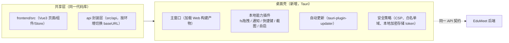

# 10 - EduMeet 桌面版 SDK 建设（终期）

> 版本：v1.1 ｜ 状态：待评审 ｜ 定位：**平台最后阶段建设**，在 Web 端全部稳定后启动
> 上游文档：00-总览 / 01-架构 / 03-API / 08-前端设计；**技术栈细化实现篇见 12-桌面版SDK技术栈与实现方案.md（Tauri 插件矩阵/桥接规范/打包签名/SDK 工程化）**

---

## 1. 目标与定位

在 Web 平台产品与 API 体系稳定后，将 EduMeet 能力延伸到桌面端与第三方生态，包含两个交付物：

1. **EduMeet Desktop 桌面客户端**：对标 ChatGPT 桌面版体验，覆盖 Windows / macOS。
2. **EduMeet 开放 SDK**：JS / Python 软件包，封装平台 API，供第三方教育工具集成对话、生成、检索能力。

**建设原则：不重复造轮子**——桌面端最大化复用 Web 前端（Vue3 代码库）与后端 API（Spec 03 契约），仅新增本地能力层。

## 2. 启动前提（Gate，全部满足才排期）

| # | 前提 | 判定标准 |
|---|---|---|
| G1 | Web 端 API 契约冻结 | Spec 03 接口一个迭代周期零破坏性变更 |
| G2 | 鉴权支持桌面端授权流 | OAuth Device Flow / 授权码 + PKCE 落地（见 §4.2） |
| G3 | 内容与模型成本模型清晰 | 配额计费（M3）稳定运行，可按端维度统计用量 |
| G4 | 自动打包与签名链路打通 | CI 产出签名安装包（macOS 公证 / Windows 代码签名） |

## 3. 技术选型：Tauri（推荐） vs Electron

| 维度 | Tauri 2.x（推荐） | Electron |
|---|---|---|
| 包体 / 内存 | 安装包约 5~10MB，内存占用低 | 安装包 80MB+，常驻 Chromium |
| 前端复用 | 直接加载同一 Vue3 构建产物 | 同左 |
| 本地能力 | Rust 插件（fs/shell/notification/clipboard） | Node 生态更成熟 |
| 团队成本 | 需少量 Rust；社区插件已够用 | 全 JS 栈，上手快 |
| 结论 | **采用 Tauri**：包体与性能对教育用户（低配电脑）更友好；Electron 作为备选预案 | |

## 4. 桌面客户端设计

### 4.1 复用策略



- 前端仓库增加 `platform` 抽象层：`isDesktop()` 分支加载本地能力，Web 端行为完全不受影响。
- UI 差异点：桌面端主窗口采用紧凑侧栏（对标 ChatGPT 桌面版），托盘常驻 + 全局快捷键唤起。

### 4.2 关键能力规格

| 能力 | 规格 |
|---|---|
| 登录授权 | OAuth 授权码 + PKCE 拉起系统浏览器 → 回调本地服务 → token 存系统钥匙串（Keychain/Credential Manager），不落明文文件 |
| 本地素材导入 | 拖拽文件夹/文件 → 复用 05 素材流水线（本地读取后走同一 presign 直传） |
| 截图问答 | 全局快捷键截图 → 自动发起多模态问答（题目讲解等教育场景） |
| 系统通知 | 生成任务完成 / 审核结果 / 回复完成，tauri notification 插件 |
| 离线缓存 | 会话列表与最近消息本地 SQLite 缓存，离线可读不可写 |
| 自动更新 | 更新清单服务端配置，静默检查 + 用户确认升级 |

### 4.3 安全红线

- CSP 严格白名单：仅允许 `api.edumeet` 域与 OSS 域；禁用远程任意页面加载。
- token 与用户自定义模型 Key 使用系统级安全存储；崩溃日志脱敏上传（可关闭）。
- 桌面端同样遵守 00 文档全局红线（内容安全/未成年人保护）。

## 5. 开放 SDK 设计（JS / Python）

### 5.1 能力范围

| 模块 | 方法（示意） |
|---|---|
| 认证 | `login(client_id, …)` / OAuth Device Flow |
| 对话 | `chat.createSession()` `chat.send(sessionId, content, {model, stream})`（SSE 迭代器） |
| 生成 | `articles.generate(topic, {materials, model})` → 任务进度流 → 草稿获取 |
| 检索 | `search(q, {scope, filters})` |
| 素材 | `materials.upload(file)` `materials.list()` |

### 5.2 使用 Demo（JS）

```js
import { EduMeetClient } from "@edumeet/sdk";

const client = new EduMeetClient({ clientId: "xxx", apiKeyOrOAuth: true });
const session = await client.chat.createSession({ model: "doubao-pro" });

for await (const ev of client.chat.send(session.id, "幼升小需要准备什么？")) {
  if (ev.type === "message_delta") process.stdout.write(ev.data.delta);
  if (ev.type === "citation") console.log("\n来源：", ev.data.citations);
}
```

### 5.3 发布与治理

- npm 包 `@edumeet/sdk`、PyPI 包 `edumeet-sdk`，语义化版本，随 API 契约版本（v1）对齐。
- 第三方接入走「应用注册 → client_id/配额 → 用量看板」流程，SDK 流量与用户流量配额隔离（复用 07 配额机制，扩展 app 维度）。
- SDK 只暴露 03 文档公开接口，管理后台接口永不进 SDK。

## 6. 里程碑排期（终期 M5，预估 4 周）

| 周 | 交付 |
|---|---|
| W1 | Tauri 工程搭建、前端 platform 抽象层改造、OAuth PKCE 登录 |
| W2 | 本地能力（素材导入/通知/快捷键/截图问答）、离线缓存 |
| W3 | 自动更新、打包签名 CI（Win/macOS）、安全评审 |
| W4 | 开放 SDK（JS 优先，Python 跟随）、示例与文档、灰度发布 |

## 7. 验收标准

- [ ] 桌面端与 Web 端共享同一前端代码库，Web 功能回归零破坏（CI 双端跑测试）
- [ ] 安装包：macOS < 15MB / Windows < 20MB，冷启动 < 2s
- [ ] OAuth 授权登录后 token 存于系统安全存储，磁盘扫描无明文
- [ ] 截图问答、文件夹素材导入、完成通知三项桌面特色能力可用
- [ ] 自动更新：发布新版本后旧版本 24h 内可收到更新提示并完成升级
- [ ] SDK：JS 包发布并附可运行示例；SSE 流式对话、生成任务进度、检索三类接口端到端通过
- [ ] 技术栈按 Spec 12 落地：插件 capabilities 最小授权评审通过；双平台签名公证 CI 通过；SDK 契约比对 CI 上线
- [ ] 第三方 app 流量配额与统计在看板可见，超额返回 42900
