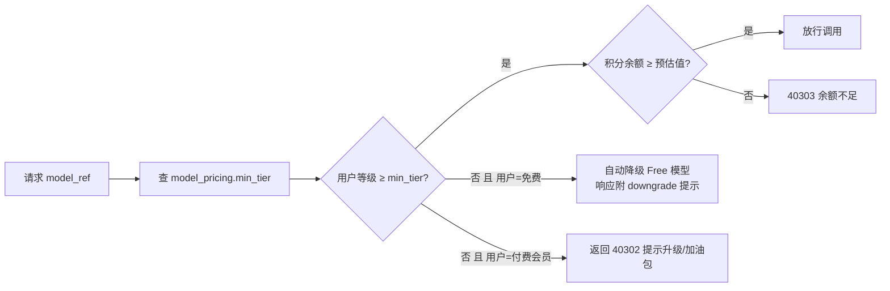

# 11 - EduMeet 账号会员与积分计费体系

> 版本：v1.0 ｜ 状态：待评审 ｜ 关联：07-大模型接入与路由 / 03-API / 02-数据模型
> 背景：大模型调用按 token 向厂商付费，平台需通过「会员分级 + 积分扣款」实现成本回收与盈利（预留 5% 利润空间），并对免费用户做沙箱控制。

---

## 1. 目标与原则

1. **沙箱控制**：免费用户只能使用免费模型与每日免费额度，无法触达付费模型。
2. **分级计费**：不同会员等级可用的模型范围不同；不同模型消耗积分不同（成本越高积分越多）。
3. **积分等比兑换**：充值金额等比兑换为积分；模型积分单价与厂商百万 token 定价等比例换算，中间保留 **5% 利润空间**。
4. **对齐市面惯例**：积分模式参考 Cursor / Manus / Genspark / 扣子（Coze）等主流 Agent 产品的通行做法——赠送积分按月过期、充值积分永久有效、余额不足自动降级、账单明细可查。

## 2. 积分换算规则（核心公式）

```
充值汇率：1 元 = 10 积分
利润系数：1.05（5% 利润空间，叠加在模型成本之上）
模型混合单价（元/百万 token）= (输入价 × 3 + 输出价 × 1) ÷ 4   # 按 输入:输出 = 3:1 加权
模型积分单价（积分/百万 token）= ceil( 混合单价 × 10 × 1.05 )    # 向上取整
生图积分单价（积分/张）= ceil( 单张成本(元) × 10 × 1.05 )
```

> 说明：混合单价随厂商调价在管理后台维护（model_pricing 表），积分单价自动重算；调价前已在途任务按旧价结算。

## 3. 模型积分价目表（P0/P1/P2 与 Spec 07 选型对齐）

### 3.1 文本模型

| 档位 | 模型 | 参考单价（元/百万tok，输入/输出） | 混合单价 | **积分/百万tok** | 免费用户 |
|---|---|---|---|---|---|
| Free | doubao-lite（免费额度） | 0 | 0 | **0** | ✅ 唯一可用 |
| S | doubao-pro | 0.8 / 2 | 0.85 | **9** | ❌ |
| S | qwen-plus | 2 / 4 | 2.5 | **27** | ❌ |
| A | deepseek-chat | 2 / 8 | 3.5 | **37** | ❌ |
| A | glm-4-air | 2 / 5 | 2.75 | **29** | ❌ |
| B | kimi-k2 | 4 / 16 | 7 | **74** | ❌ |
| B | qwen-vl-plus（图像理解） | 约 3 混合 | 3 | **32** | ❌ |
| C | gpt-4o-mini（折 RMB） | 约 1.9 混合 | 1.9 | **20** | ❌ |

### 3.2 生图模型（按张）

| 档位 | 模型 | 单张成本 | **积分/张** | 免费用户 |
|---|---|---|---|---|
| Free | 通义万相-测试档 | 平台赠送额度 | **0（每日 2 张）** | ✅ |
| S | 通义万相 wanx2.x | 约 0.14 元 | **2** | ❌ |
| S | Seedream | 约 0.3 元 | **4** | ❌ |
| A | Qwen-Image | 约 0.25 元 | **3** | ❌ |
| B | FLUX.2（三方托管） | 约 1.3 元 | **14** | ❌ |
| C | GPT Image 2 | 约 3.5 元 | **37** | ❌ |

### 3.3 平台功能积分（非 LLM 成本，象征性计费）

| 功能 | 积分 |
|---|---|
| 文章自动生成任务（编排服务费，不含模型消耗） | 5/次 |
| 文档解析打标（>10MB 大文件） | 2/个 |

## 4. 会员等级与获取方式

| 等级 | 获取方式 | 可用模型范围 | 每月赠送积分 | 并发任务 | 免费日额度 |
|---|---|---|---|---|---|
| 免费用户 | 注册即得 | 仅 Free 档 | 0 | 1 | 对话 20 次/日、生成 2 篇/日、识图 5 次/日、测试生图 2 张/日 |
| 尊享会员 | 月卡 ¥99 / 年卡 ¥799 | 全部模型（含 B/C 档海外模型与生图） | 9000/月 | 3 | 同上 |
| 积分加油包 | 任意等级可购：¥10=100；¥50=520（赠 4%）；¥100=1100（赠 10%） | — | 永久有效 | — | — |

> 等级与赠送额度对标市面（Cursor 订阅档位 / Genspark 每日积分 / 扣子资源点）定价习惯：订阅赠积分按月发放、当月未用完月末清零；加油包充值积分永久有效。首充赠 500 积分；连续订阅年卡额外赠 10% 积分。

## 5. 沙箱控制设计（免费用户隔离）



- **强制点在 LiteLLM 路由层**（`app/llm/router.py`），业务接口不可绕过；免费模型直连名单硬编码兜底，防止 pricing 表误配导致免费用户触达付费模型。
- 免费日额度用 Redis `INCR + 当日 24 点过期` 计数（key：`quota:{uid}:{scene}:{yyyyMMdd}`）。
- 降级体验：SSE 流中下发 `event: notice`（`{type:"model_downgraded", to:"doubao-lite"}`），前端输入区显示「免费模式」角标与升级入口。

## 6. 扣费流程（两阶段：预检 → 结算）

1. **预检**：调用前按模型积分单价 × 预估 token（输入长度 + max_output）估算，余额不足直接拒绝（40303），不产生厂商成本。
2. **结算**：响应完成后按实际 `usage`（prompt/completion tokens）计算积分，写入积分流水并扣减余额；流式对话在 `done` 事件后结算；生成任务按各 Agent 节点消耗汇总到 task 一次性结算。
3. **幂等**：ledger 以 `ref_type + ref_id`（message_id / task_id）唯一约束，重试不重复扣款。
4. **失败退还**：LLM 调用失败且已扣预扣额度的，自动全额退还并记录 refund 流水。
5. **明细可查**：用户可在个人中心查看每笔消耗的模型、token 数、积分、时间。

## 7. 数据模型（新增表，纳入 02 文档体系）

| 表 | 关键字段 | 说明 |
|---|---|---|
| memberships | user_id(UQ), tier(free/premium), expire_at, auto_renew | 会员等级，一人一条 |
| credit_accounts | user_id(UQ), balance_paid, balance_gift | 双余额：充值积分（永久）/ 赠送积分（按月过期，FIFO 先扣） |
| credit_ledger | user_id, delta, type(recharge/gift/consume/refund/expire), ref_type, ref_id(UQ with type), model_ref, tokens, balance_after | 积分流水（审计与对账） |
| model_pricing | model_ref(UQ), tier, input_price, output_price, credits_per_mtok, credits_per_image, effective_at | 模型价目（管理后台维护） |
| recharge_orders | order_no(UQ), user_id, sku, amount, credits, bonus_credits, channel, status | 充值/订阅订单 |
| free_quota_usage | user_id, date, scene, used(UQ: user+date+scene) | 免费日额度持久化（Redis 为准，落库对账） |

> 充值/订阅对接支付渠道（微信/支付宝）走异步回调，回调验签成功才入账；对账任务每日核对渠道账单与 recharge_orders。

## 8. API 设计（补充至 03 文档）

| 方法 | 路径 | 说明 |
|---|---|---|
| GET | /membership | 当前等级、到期时间、可用模型范围 |
| POST | /membership/subscribe | 创建订阅订单 `{sku}` → 支付回调生效 |
| GET | /billing/summary | 积分余额（充值/赠送分列）、本月消耗 |
| GET | /billing/pricing | 模型积分价目表（前端模型选择器展示消耗） |
| GET | /billing/ledger | 积分流水 `{type?, page}` |
| POST | /billing/recharge | 创建充值订单 `{sku}` → 支付回调入账 |
| POST | /billing/notify | 支付渠道异步回调（验签、幂等入账） |

新增错误码：`40302 会员等级不足（该模型需升级会员）`、`40303 积分余额不足`、`40304 免费日额度已用完`。

## 9. 前端呈现要点

- 模型选择器每个模型标注「积分消耗/次预估」，免费模型带「免费」角标；免费用户付费模型置灰+锁标。
- 输入区常驻积分余额角标；余额 < 阈值（约 10 次对话）时提示加油包。
- 个人中心新增「会员与积分」页：当前等级/到期、余额卡、充值档位（含赠送标注）、流水明细、免费额度进度条。

## 10. 验收标准

- [ ] 免费账号全链路（对话/生成/生图/检索问答）仅能触达 Free 档模型；伪造 model_ref 请求被沙箱拦截并降级（渗透用例）
- [ ] 积分单价与公式（§2）计算一致：三档模型各抽样 20 次真实调用，账单积分 = ceil(混合价×10×1.05×实际百万token) 误差 0
- [ ] 双余额 FIFO 扣减正确；赠送积分月末清零任务（Celery Beat）有对账单
- [ ] 支付回调重复投递不重复入账（幂等用例）；退款仅退未消耗充值积分
- [ ] 余额不足预检拦截返回 40303，不产生厂商调用成本
- [ ] 前端模型选择器积分标注、免费角标、降级提示、会员页全部可用
